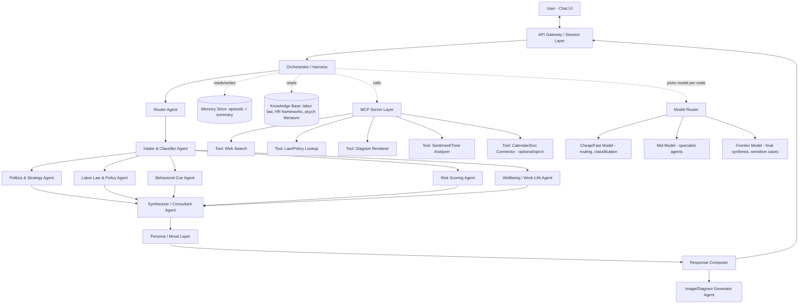
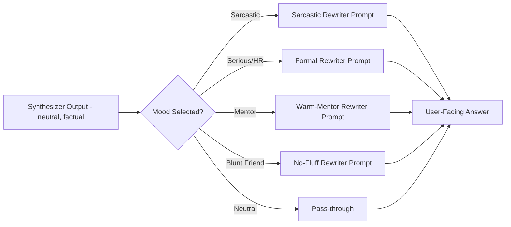
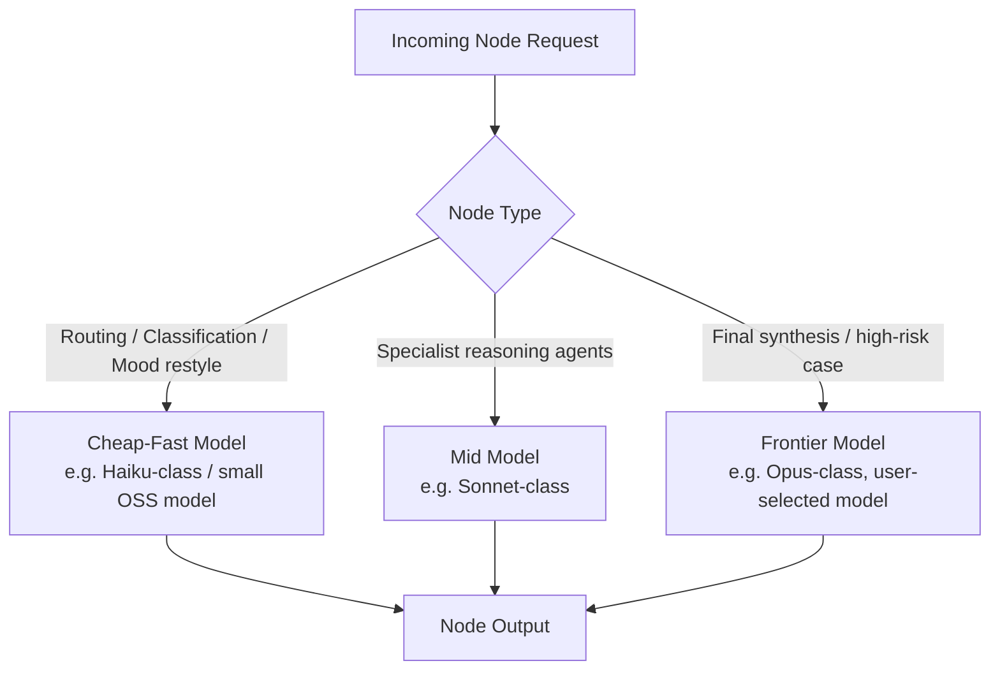
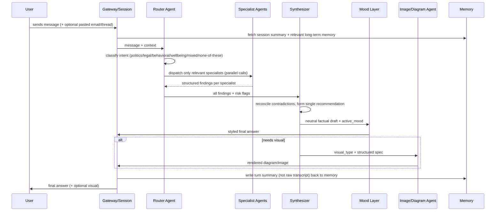
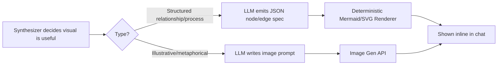

# Corporate_AURA — Multi-Agent System Flow & Architecture

> A consulting-style multi-agent bot for corporate politics, workplace law awareness, behavioral risk analysis, and career survival strategy.

---

## 1. Vision & Scope

**What it is:** A ChatGPT/Claude-style conversational bot, backed by a multi-agent system, specialized as a "corporate survival consultant." It reads a user's situation (a message, an email thread, a meeting recap), classifies the risk, cross-checks relevant policy/labor context, reads behavioral/tone cues, and returns a structured recommendation — not just a chat reply.

**Core differentiators vs. a plain LLM wrapper:**
- Multi-agent reasoning (not one giant system prompt) — each concern (law, politics, psychology, risk) is a specialist agent
- Mood/persona toggle (Sarcastic / Serious / Neutral-HR / Mentor / Blunt-Friend)
- Model-agnostic — user can swap the underlying LLM per session or per turn
- Generates diagrams (org-politics maps, escalation trees, decision trees) and images on demand
- Cost-aware routing — cheap models for classification/routing, expensive models only for final synthesis

**Out of scope (v1):** giving binding legal advice (it informs, not certifies), real-time integration with the user's actual company Slack/email (privacy risk — v2+ maybe, opt-in only).

---

## 2. High-Level Architecture



**Reading the diagram:** the Harness never lets the user talk to a single monolithic agent. Every message is *intaken*, *classified*, fanned out to relevant specialists (not all five run every time — see §6 routing logic), *synthesized* into one coherent answer, *stylized* by the mood layer, and only then shown to the user.

---

## 3. Core Components

### 3.1 The Harness (Orchestrator)
This is the brain that decides *which agents run, in what order, with what model, and when to stop.*

- **Recommended base:** LangGraph (stateful graph orchestration — fits your existing hybrid-RAG/LangGraph experience directly; this becomes your 4th anchor project using the same mental model as your baseball analysis project, but with conditional multi-agent branching instead of a linear pipeline).
- **Alternative:** CrewAI (role-based, simpler mental model, weaker fine-grained control) — you already have a CrewAI project, so comparing both in your portfolio narrative is a strong "I understand orchestration tradeoffs" talking point in interviews.
- **State object** (the thing passed node-to-node) should carry:
  - `user_message`, `conversation_summary`, `full_history_pointer`
  - `situation_classification` (politics / legal / behavioral / burnout / mixed)
  - `risk_score`, `risk_flags`
  - `active_mood`, `active_model_tier`
  - `agent_outputs: {politics: ..., legal: ..., behavioral: ..., wellbeing: ...}`
  - `needs_visual: bool`, `visual_type: str`

### 3.2 Agent Roster

| Agent | Job | Typical Model Tier |
|---|---|---|
| **Router Agent** | Decides which specialists are relevant to this turn (don't run all 5 every time — cost killer) | Cheap/Fast |
| **Intake & Classifier Agent** | Extracts entities: who, what happened, power dynamics, timeline, evidence available | Cheap/Fast |
| **Politics & Strategy Agent** | Office-politics read: power maps, alliances, likely motives, "what would a savvy operator do" | Mid |
| **Labor Law & Policy Agent** | Surfaces relevant labor law/HR policy *categories* (jurisdiction-aware disclaimer required) | Mid, RAG-grounded on KB |
| **Behavioral Cue Agent** | Reads tone/subtext in pasted messages/emails — passive aggression, gaslighting patterns, DARVO, etc. | Mid |
| **Risk Scoring Agent** | Converts everything into a structured risk score (career risk, legal exposure, mental-health risk) | Mid, deterministic rubric + LLM judgment |
| **Wellbeing Agent** | Work-life balance, burnout signals, boundary-setting scripts | Mid |
| **Synthesizer / Consultant Agent** | Merges all specialist outputs into one coherent, non-contradictory consult | Frontier (this is the "money" step) |
| **Mood/Persona Layer** | Rewrites final answer in the selected voice without changing facts | Cheap/Fast (style-only pass) |
| **Image/Diagram Agent** | Decides + generates visual (escalation flowchart, org power map, decision tree) | Tool call, not LLM-heavy |

> Design rule: **specialist agents never talk to the user directly.** Only the Synthesizer + Mood layer produce user-facing text. This prevents 5 disjointed mini-answers glued together.

### 3.3 MCP Server Layer (Tools & Connectors)

Expose these as MCP tools so any agent (or future client) can call them uniformly:

| MCP Tool | Purpose | Notes |
|---|---|---|
| `web_search` | Current labor-law news, company reviews (Glassdoor-style context) | Rate-limit + cache |
| `law_policy_lookup` | RAG over a curated KB of labor law summaries (jurisdiction-tagged, e.g. India Shops & Establishment Act, POSH Act, US at-will/EEOC, etc.) | This is your hybrid-RAG project reused — same reranker pipeline |
| `tone_sentiment_analyzer` | Classifies pasted text for manipulation patterns, sentiment, aggression | Small local model or classifier, not frontier LLM — cost control |
| `diagram_renderer` | Turns a structured spec (nodes/edges JSON) into Mermaid/SVG | Deterministic, no LLM needed at render time |
| `image_generator` | On-demand illustrative images (org chart mockups, mood-board style visuals) | External image API behind MCP |
| `calendar_doc_connector` (opt-in, v2) | Pull meeting notes/emails *only with explicit per-use consent* | Big privacy flag — gate behind explicit toggle + redaction pass |
| `memory_store` | Read/write episodic + summarized long-term memory | Vector DB + structured KV |

**Why MCP specifically (not just direct function calls):** it decouples tools from any one agent framework, lets you swap LangGraph↔CrewAI↔custom harness without rewriting tool logic, and it's the same interface pattern Claude/ChatGPT-style clients use — a strong "I understand the ecosystem" point for interviews.

---

## 4. Persona / Mood Engine

Moods are a **presentation-layer transform**, never a fact-layer transform. The Synthesizer produces mood-neutral, fact-complete output first; the Mood layer only restyles tone, never changes the risk score, legal info, or recommended action.



- Mood is a **session-level toggle** (UI switch, like a model picker) plus a **per-message override** ("answer that sarcastically").
- Store `active_mood` in session state so it persists until changed.
- Each mood = a short, versioned system-prompt fragment + few-shot style examples, NOT a different model.
- Guardrail: sarcasm mode still must not undercut a genuinely high-risk situation (e.g., harassment) — the Risk Score should be able to **suppress/soften sarcasm automatically** when `risk_score` crosses a threshold. This is an important product-safety detail worth highlighting in interviews.

---

## 5. Model Routing Layer

Users get a model picker (like Claude/ChatGPT), but internally the harness *also* routes per-node regardless of the user-facing model, to control cost:



- **User-facing "model switch"** = which model powers the Synthesizer + chat voice (the part they actually "feel").
- **Internal routing** = everything upstream of that stays cheap by default; only escalates to the user's chosen frontier model when `risk_score` is high or the user explicitly asks for deeper reasoning.
- Cache aggressively: identical/near-identical classifier calls (e.g., "is this about labor law?") shouldn't hit an LLM twice — use embedding-similarity cache.

---

## 6. Conversation Turn — Detailed Flow



**Routing shortcut (cost saver):** if the Router classifies the message as low-complexity small talk or a follow-up clarification, it skips straight to a lightweight single-agent reply — the full fan-out only triggers for genuinely new "situations."

---

## 7. Image & Diagram Generation Pipeline

Two very different needs — keep them as separate tools:

1. **Structured diagrams** (escalation flowchart, decision tree, "who reports to whom" power map) → generate a small JSON spec (`nodes`, `edges`, `labels`) via LLM, then render deterministically via Mermaid/SVG. Cheap, consistent, no hallucinated shapes.
2. **Illustrative images** (mood-board, motivational visual, "here's a metaphor for your situation") → structured prompt → external image-gen API. Used far less often; gate behind explicit user request to control cost.



---

## 8. Risk Analysis Engine

Not just an LLM vibe-check — should be a **hybrid rubric + LLM** so it's explainable and consistent:

- Fixed axes, each scored 0–5: `career_risk`, `legal_exposure`, `psychological_safety_risk`, `reputational_risk`, `urgency`.
- Deterministic rule layer flags hard triggers regardless of LLM score (e.g., mentions of harassment, discrimination, threats, retaliation → auto-escalate urgency + surface relevant law agent + suppress sarcasm mood).
- LLM fills in the nuanced axes; rules layer overrides/floors them for safety-critical categories.
- Output: a small radar/bar chart (via the diagram tool) + one-paragraph plain-English risk summary + recommended next-step tier (self-manage / document & monitor / escalate to HR / seek legal counsel / seek external support).

---

## 9. Legal & Compliance Knowledge Layer

- Build as a **RAG store, jurisdiction-tagged** (this is a direct reuse of your hybrid RAG + reranker project — same architecture, different corpus).
- Curate sources: statutory summaries (not raw legalese), HR-policy pattern libraries, publicly available labor-rights explainers.
- Every legal-adjacent answer carries a **standing disclaimer**: "this is general information, not legal advice — for anything with real exposure, consult a licensed employment lawyer in your jurisdiction."
- Ask user's country/state once per session (or infer from context) and tag retrieval accordingly — never assume US-only defaults given your own market is India.

---

## 10. Memory & Context Management

| Layer | What's stored | Lifespan |
|---|---|---|
| **Working context** | current turn + last N turns raw | session |
| **Session summary** | rolling compressed summary of the situation being discussed | session, regenerated every ~5 turns |
| **Episodic memory** | key facts about the user's recurring workplace situation (their manager's name, recurring conflict pattern, etc.) | persistent, user-controlled, deletable |
| **No raw sensitive transcripts long-term** | avoid storing verbatim pasted emails beyond session | privacy-first default |

Give the user an explicit "forget this" control — critical for a product literally about sensitive workplace conflict.

---

## 11. Cost & Token Optimization Strategy

- **Fan-out only what's needed** — Router Agent prevents running all 5 specialists on every message.
- **Tiered models** — cheap model for routing/classification/mood-restyle, mid model for specialists, frontier only for synthesis/high-risk.
- **Semantic caching** — cache classifier + law-lookup results on embedding similarity, not exact string match.
- **Summarize, don't replay** — session memory is compressed, not raw history resent every turn.
- **Deterministic rendering over LLM re-generation** — diagrams render from a JSON spec, not from a fresh LLM call each time.
- **Batch specialist calls in parallel**, not sequential, to cut latency (cost-neutral but a real UX win).
- **Token budget guardrails** — cap specialist outputs (e.g., 150 tokens each) since only the Synthesizer needs full nuance; specialists should return structured findings, not essays.

---

## 12. Suggested Tech Stack

| Layer | Choice | Why |
|---|---|---|
| Orchestration | LangGraph | Matches your existing project experience; strong conditional branching support |
| Tool interface | MCP (Model Context Protocol) | Framework-agnostic, portfolio-relevant, matches how Claude/modern clients work |
| Vector store | ChromaDB (free tier, matches your RAG project) | Already proven in your stack |
| Reranker | `cross-encoder/ms-marco-MiniLM-L-6-v2` | Same one from your hybrid RAG project — direct reuse |
| Backend | FastAPI | You already have a mastery guide for this |
| Frontend | Simple React chat UI (streaming) | Model/mood picker as dropdowns, like Claude/ChatGPT |
| Model access | Groq (fast/cheap tier) + Anthropic/OpenAI API (frontier tier) | Matches your "free tools first" build pattern |
| Diagram rendering | Mermaid.js (client-side render of LLM-emitted spec) | Deterministic, cheap |
| Image generation | Any hosted image API behind an MCP tool wrapper | Keep swappable |
| Deployment | Docker → same CI/CD pattern as your other projects | Consistency across your portfolio |

---

## 13. Suggested Folder Structure

```
corporate_aura/
├── harness/
│   ├── graph.py                # LangGraph state graph definition
│   ├── state.py                # shared state schema
│   └── router.py                # router agent logic
├── agents/
│   ├── intake.py
│   ├── politics.py
│   ├── legal.py
│   ├── behavioral.py
│   ├── risk_scoring.py
│   ├── wellbeing.py
│   ├── synthesizer.py
│   └── mood_layer.py
├── mcp_server/
│   ├── server.py
│   ├── tools/
│   │   ├── web_search.py
│   │   ├── law_policy_lookup.py
│   │   ├── tone_sentiment_analyzer.py
│   │   ├── diagram_renderer.py
│   │   ├── image_generator.py
│   │   └── memory_store.py
├── rag/
│   ├── ingest.py                 # reused hybrid RAG pipeline
│   ├── reranker.py
│   └── kb/                       # jurisdiction-tagged legal/HR corpus
├── model_router/
│   └── tiering.py
├── backend/
│   └── main.py                   # FastAPI app, session mgmt, streaming
├── frontend/
│   └── (chat UI: model picker, mood toggle, message stream)
├── evals/
│   └── (risk-scoring accuracy, mood-consistency, groundedness evals)
└── docker/
    └── Dockerfile, docker-compose.yml
```

---

## 14. Build Phases

1. **Phase 1 — Skeleton harness:** single Router + Synthesizer + one specialist (Politics), no mood, no images. Prove the fan-out/merge pattern works.
2. **Phase 2 — Add remaining specialists + Risk Scoring Agent** with the deterministic-rule override layer.
3. **Phase 3 — Mood/persona layer** as a restyle pass; add mood-safety suppression logic for high-risk cases.
4. **Phase 4 — MCP-ify all tools** (move from direct function calls to proper MCP server), add model-tier router.
5. **Phase 5 — RAG legal KB** (reuse your hybrid RAG + reranker), jurisdiction tagging.
6. **Phase 6 — Diagram + image generation pipeline.**
7. **Phase 7 — Memory layer + privacy controls** (forget/delete, session summarization).
8. **Phase 8 — Evals:** groundedness of legal answers, risk-score consistency, mood doesn't distort facts, cost-per-conversation benchmarks.
9. **Phase 9 — Dockerize + deploy**, same CI/CD pattern as your other anchor projects.

---

## 15. Open Decisions To Make Before Building

- Which jurisdictions does the legal KB cover at launch — India only, or India + a couple of major markets?
- Does the "behavioral cue" agent ever analyze pasted real messages from third parties (privacy/consent implications) — worth a clear in-app disclaimer either way.
- How many moods ship in v1 — recommend starting with 3 (Serious/HR, Mentor, Sarcastic) rather than 5+, to keep prompt-variant testing manageable.
- Self-hosted vs. API-based small model for the tone/sentiment classifier (cost vs. control tradeoff).
- How aggressive should the deterministic risk-override rules be (false positives annoy users, false negatives are a real safety miss) — needs an eval set specifically for this.
